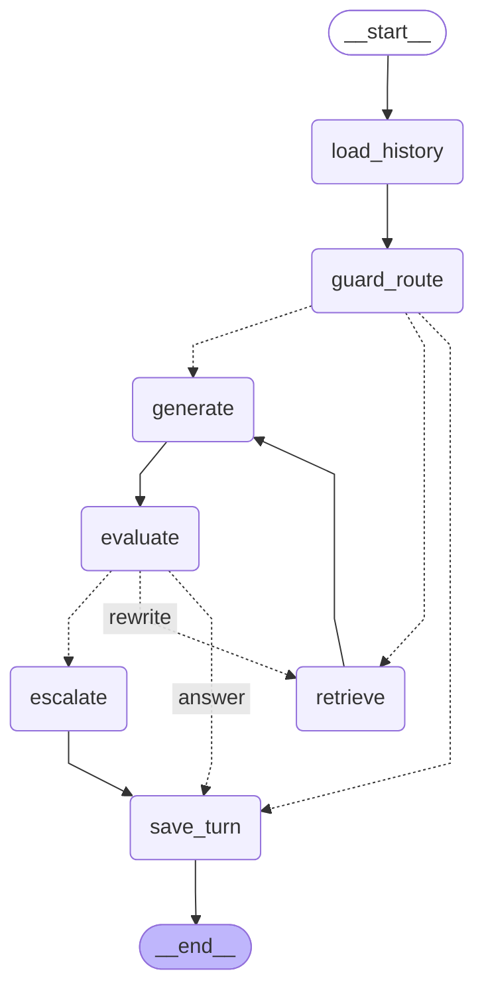

# Project Structure

## Directory Organization

```text
simplon-rag-sample/
├── src/rag/                # Application source package
│   ├── config/
│   │   └── settings.py         # Pydantic BaseSettings (all env vars)
│   ├── db/
│   │   ├── base.py             # SQLAlchemy DeclarativeBase
│   │   ├── session.py          # Async engine + get_db()
│   │   └── models/
│   │       ├── document.py     # Document + DocumentChunk ORM models
│   │       └── conversation.py # Conversation + Message ORM models
│   ├── rag/                    # RAG engine (pure domain logic, no HTTP)
│   │   ├── agent/
│   │   │   ├── state.py        # AgentState TypedDict
│   │   │   ├── prompts.py      # SYSTEM_PROMPT, ROUTE_PROMPT, RAG_PROMPT
│   │   │   ├── nodes.py        # LangGraph node functions (async)
│   │   │   └── graph.py        # build_graph() → CompiledGraph
│   │   ├── embeddings/
│   │   │   └── mistral_embeddings.py # Wrapper MistralAIEmbeddings
│   │   ├── ingestion/
│   │   │   ├── pdf_loader.py   # pypdf → list[str] per page
│   │   │   ├── chunker.py      # RecursiveCharacterTextSplitter
│   │   │   └── pipeline.py     # SHA-256 dedup → load → chunk → embed → store
│   │   └── retriever/
│   │       └── pgvector_retriever.py # Cosine similarity search via <=>
│   ├── api/
│   │   ├── app.py              # create_app() FastAPI factory
│   │   └── routers/
│   │       ├── health.py       # GET /api/v1/health
│   │       ├── ingestion.py    # POST/GET/DELETE /api/v1/documents
│   │       ├── chat.py         # POST/GET /api/v1/conversations
│   │       └── eval.py         # POST /api/v1/eval/run
│   ├── evaluation/
│   │   └── ragas_pipeline.py   # Ragas evaluation runner
│   └── cli/                    # Standalone entry points (no FastAPI)
│       ├── _runner.py          # Lazy async DB session for CLI use
│       ├── ingest.py           # python -m rag.cli.ingest
│       └── eval.py             # python -m rag.cli.eval
├── data/
│   ├── alembic/                # DB migrations
│   │   ├── env.py              # Async Alembic env
│   │   └── versions/
│   │       ├── 0001_documents.py
│   │       ├── 0002_conversations.py
│   │       └── 6a6d4579355d_fix_uuid_types.py
│   ├── db/
│   │   └── init/
│   │       └── init.sql        # CREATE EXTENSION vector (Docker init)
│   ├── docs/                   # PDF files consumed by the ingest CLI
│   └── evaluation/
│       └── samples.json        # Ground-truth dataset for the eval CLI
├── src/app/                    # Streamlit chat UI
│   ├── app.py                  # Main Streamlit application entry point
│   ├── api_client.py           # httpx helpers (create_conversation, send_message)
│   ├── config.py               # UI configuration (API_BASE_URL)
│   └── .streamlit/
│       └── config.toml         # Streamlit theme and server settings
├── tests/
│   ├── conftest.py             # Fixtures (SQLite in-memory, mock embeddings)
│   ├── unit/
│   │   ├── test_chunker.py
│   │   └── test_ingestion_pipeline.py
│   ├── integration/
│   │   ├── test_api_chat.py
│   │   └── test_api_ingestion.py
│   └── streamlit_app/          # Tests for the Streamlit UI
│       └── test_api_client.py  # Unit tests for api_client helpers
├── .github/                    # GitHub configuration
├── docs/                       # Documentation
├── alembic.ini                 # Alembic config (script_location → data/alembic)
├── pyproject.toml
├── uv.lock
├── .python-version
├── main.py
├── .env.example
├── .pre-commit-config.yaml
├── .pymarkdown
├── CLAUDE.md
└── README.md
```

---

## LangGraph Agent

Compiled graph rendered from `src/rag/rag/agent/graph.py` (`build_graph()`):



---

## Configuration Files

### Python

| File | Purpose |
|------|---------|
| `pyproject.toml` | Python project metadata and dependencies |
| `uv.lock` | Locked Python dependency versions |
| `.python-version` | Python version pin for uv |

### Code Quality

| File | Purpose |
|------|---------|
| `.pymarkdown` | Markdown linting rules (pymarkdownlnt) |
| `.yamllint.yml` | YAML linting rules |
| `.editorconfig` | Editor settings (indentation, EOL) |

### CI/CD

| File | Purpose |
|------|---------|
| `.github/workflows/lint.yml` | Lint on push/PR |
| `.github/workflows/release.yml` | Automated releases |
| `.github/settings.yml` | Repository settings |
| `renovate.json` | Automatic dependency updates |
| `.github/dependabot.yml` | Security updates |

### Git Hooks

| File | Purpose |
|------|---------|
| `.pre-commit-config.yaml` | Git hooks managed by pre-commit |

---

## Documentation (`docs/`)

| File | Purpose |
|------|---------|
| `AGENTS.md` | Main guide for AI assistants |
| `PROJECT_STRUCTURE.md` | This file - directory layout |
| `CONVENTIONS.md` | Code style and git conventions |
| `TECHNICAL_GUIDE.md` | Technical implementation details |
| `FEATURES.md` | Epics and user stories |
| `TASKS.md` | Project task tracking |

---

*Last updated: 2026-05-05 — added `src/rag/cli/` (ingest + eval entry points), `data/docs/` & `data/evaluation/` directories, and the LangGraph agent diagram.*
